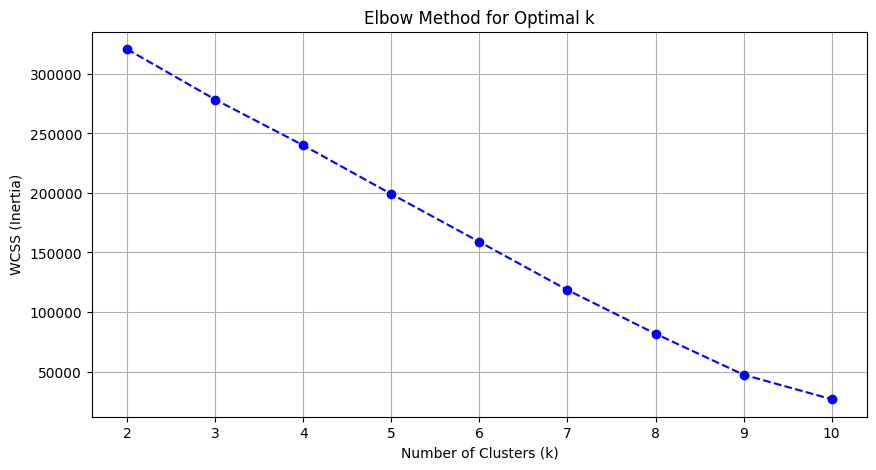
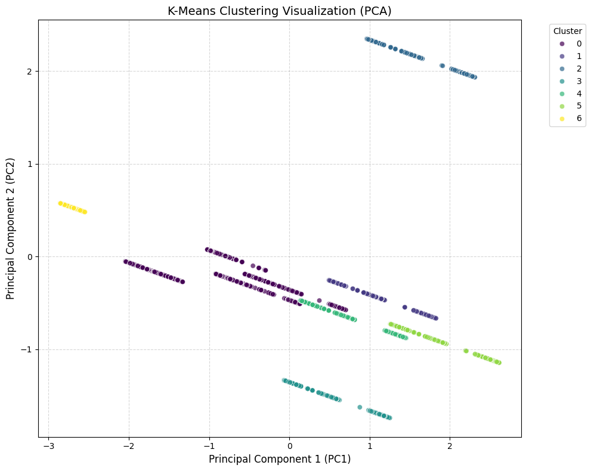

# Product Clustering — PriceRunner Dataset

Segmentasi produk e-commerce dari dataset **PriceRunner Product Aggregate** menggunakan algoritma **K-Means Clustering**. Proyek ini mencakup eksplorasi data, preprocessing, penentuan jumlah cluster optimal (Elbow Method & Silhouette Score), training model, dan visualisasi hasil cluster dengan PCA.

## 📁 Struktur Repository

```
Clustering/
├── data/
│   └── pricerunner_aggregate.csv   # Dataset
├── images/
│   ├── elbow_method.png            # Plot Elbow Method
│   └── pca_clusters.png            # Visualisasi cluster (PCA 2D)
├── src/
│   ├── data_loader.py              # Load & eksplorasi data
│   ├── preprocessing.py            # Encoding & scaling fitur
│   ├── clustering.py               # Elbow, Silhouette, training KMeans
│   └── visualization.py            # Plot Elbow & PCA
├── main.py                         # Pipeline utama
├── requirements.txt
└── README.md
```

## 🚀 Cara Menjalankan

```bash
git clone https://github.com/haikalfr04/Clustering.git
cd Clustering
pip install -r requirements.txt
python main.py
```

Plot akan disimpan ke folder `images/` dan dataset beserta label cluster disimpan ke `outputs/pricerunner_clustered.csv`.

## 📊 Dataset

| Keterangan | Nilai |
|---|---|
| Jumlah baris | 35.311 |
| Jumlah kolom | 7 |
| Missing values | 0 |
| Kategori produk unik | 10 |
| Product Title unik | 30.993 |
| Cluster Label (ground truth) unik | 12.849 |
| Kategori terbanyak | Fridge Freezers (5.501 produk) |

Kolom: `Product ID`, `Product Title`, `Merchant ID`, `Cluster ID`, `Cluster Label`, `Category ID`, `Category Label`.

Kategori produk: Mobile Phones, TVs, CPUs, Digital Cameras, Microwaves, Dishwashers, Washing Machines, Freezers, Fridge Freezers, Fridges.

## ⚙️ Metodologi

### 1. Preprocessing
- Menghapus whitespace di nama kolom.
- Mengecek missing values (tidak ditemukan).
- Menghapus kolom identifier/granular (`Product ID`, `Product Title`) dan kolom ground truth (`Cluster ID`, `Cluster Label`) agar tidak terjadi *data leakage*.
- *One-Hot Encoding* pada `Category Label` (`drop_first=True`).
- Standarisasi fitur dengan `StandardScaler` → menghasilkan **11 fitur**.

### 2. Menentukan Jumlah Cluster Optimal

**Elbow Method** (WCSS untuk k = 2–10):



**Silhouette Score** (dihitung pada sampel 5.000 data):

| k | Silhouette Score |
|---|---|
| 2 | 0.2219 |
| 3 | 0.2955 |
| 4 | 0.3620 |
| 5 | 0.4385 |
| 6 | 0.4884 |
| **7** | **0.5809** |

Silhouette Score terus meningkat dan mencapai nilai tertinggi pada **k = 7**, sehingga k = 7 dipilih sebagai jumlah cluster.

### 3. Training Model
Model `KMeans(n_clusters=7, random_state=42, n_init=10)` dilatih pada seluruh data yang sudah di-scale, lalu label cluster ditambahkan ke dataset asli sebagai kolom `KMeans_Cluster`.

### 4. Visualisasi Cluster (PCA)

Fitur direduksi menjadi 2 komponen utama (PC1 & PC2) dengan PCA:



## 🔍 Hasil & Insight

- Dataset bersih (tanpa missing value) dengan 35.311 produk dari 10 kategori.
- Jumlah cluster optimal adalah **7** dengan Silhouette Score **0.5809**, menunjukkan struktur cluster yang cukup kuat.
- Visualisasi PCA memperlihatkan 7 cluster yang terpisah dengan jelas di ruang 2 dimensi.
- Karena fitur yang dipakai didominasi hasil one-hot encoding `Category Label`, cluster yang terbentuk cenderung mengelompokkan produk berdasarkan kategori dan `Merchant ID`.

## 📌 Next Steps

- **Profiling cluster:** melakukan group-by berdasarkan `KMeans_Cluster` untuk melihat komposisi kategori dan merchant di tiap cluster.
- **Evaluasi terhadap ground truth:** membandingkan hasil KMeans dengan `Cluster ID`/`Category Label` menggunakan metrik seperti *Adjusted Rand Index (ARI)* atau *Normalized Mutual Information (NMI)*.
- **Rentang k lebih luas:** Silhouette Score masih naik di k = 7, sehingga perlu diuji untuk k > 7.
- **Fitur teks:** memanfaatkan `Product Title` (misalnya TF-IDF) agar clustering lebih informatif.

## 🛠️ Tech Stack

Python · pandas · NumPy · scikit-learn · Matplotlib · Seaborn

## 📚 Sumber Data

[PriceRunner Product Classification and Clustering — UCI Machine Learning Repository](https://archive.ics.uci.edu/dataset/837/product+classification+and+clustering)
